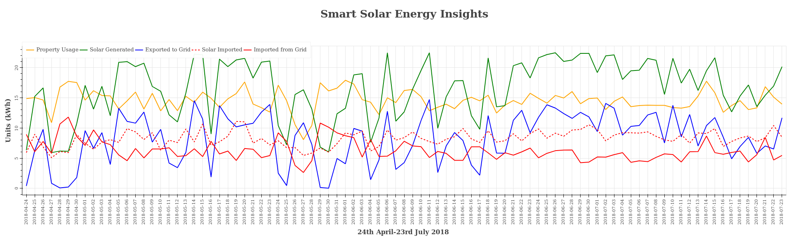

# Solar investment insights
A household has invested £7000 on Solar Panels. Electricity bills stands at £180 between Apr &amp; July 2018. Is this investment worth. Let us find out what Data Says?

***Data:*** 

  **Solar Energy:** Solar Energy Data is sourced from OWL Intution (https://www.owlintuition.com/) using household account.
        Data Contains Solar Energy Generated , Exported to the National Grid, Imported in to Household , 
        Total Energy consmed by   household(Dranwn from National Grid and Drawn from Solar system) in cumulative amounts.  
  **Electricity:** Southern Electric (SSE) is the provider of Gas & Electricty to the house hold. 
        The Samrt usage facility will provide us energy consumed in (Wh) for every 30 minutes of a day.
 
**Phase 1:**

    Plot an interactive graphs showing Solar Energy generated, Solar Energy  Exported, Solar Energy Consumed by 
    Household(Imported) and Total energy utilised by property. 
    
    Identify patterns.
    
    Plot should be interactive: 
    
      Hide or show plots by clicking on legend.
      Display units on hovering on data points.
      
    Calculate the Total Energy consumption in Kwh from Smart Solar Data and compare with the 
    actual billed units from SSE.
    
**Technical Components:**

    Python, Pandas, Numpy, bokeh
    Jupyter Notebook
    csv files (Downloaded from (https://www.owlintuition.com/) & (https://my.sse.co.uk/your-account/login)
    Mongodb : To Store the data for further analysis.
 **Output**
 loink to the ...https://venugudavalli.github.io/solar-energy-insights/24Apr_23July2018_Electricity_Insights_new.html
 Insights ino data:
 
 
    
 Conclusions: Data is collected between April & July, which seems to be  very productive for SOlar Energy Generation.
 There are certain home appliances Eelctric Coocker, Vaccum Cleaner, Iron Box, Washing Machine which consumes higher units when compared to other lighting , compuetrs, TV etc.
 
 The Solar energy generated will be exported to grid will earn 4.11 p per unit. Whereas Elctricity imported from grid will cost 18 p per unit.
 Hence it is obvious that if those high rated appliances are operated during high solar gernation times of a day (1000 to 2000 Hrs) periods then billable units will be minimised. 
 
 Further analysis is required during winter times, as solar genration will not be at optimum levels, to understand the overal utilisation of solar energy and predict roi.
  
